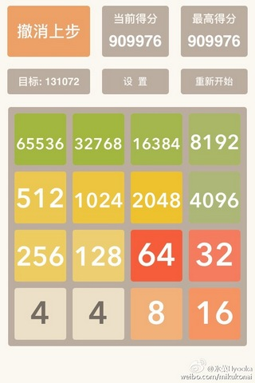

# PSP-2048

Game "2048" on PSP

一款运行在PSP控制台上的2048。2015年暑假尝试PSP开发时写的。

## 玩法

* 将`EBOOT.PBP`复制到PSP实机存储卡中，或者使用PPSSPP等模拟器打开。
* 使用上下左右键移动，“□”键撤销，最多撤销16步。
* 不设最高分，但是在所有框框都被填满且无法移动的情况下，游戏结束。

## 开发环境

已经不记得是怎么配置的了。请自行搜索相关资料。

## 协议

MIT

## P.S.

最近完全不想学习，只想摸鱼，在硬盘里搜刮游戏存货的时候，意外发现了这个东西。想当年我也曾经沉迷2048一段时间呢。

那么开始二刷空轨吧！
